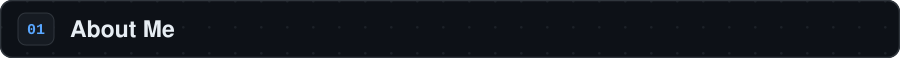
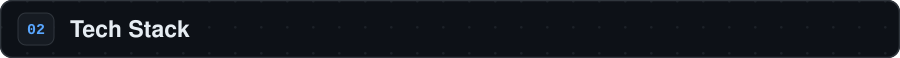
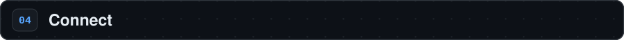

<div align="center">


<p>
  
  
  &nbsp;
  <a href="https://www.linkedin.com/in/youssef-alshwawra-2b56482a0/" target="_blank">
    
  </a>
  <a href="mailto:yousef.alshwawra@gmail.com">
    
  </a>
</p>

</div>

<br/>



```yaml
name: Youssef Al-Shwawra
role: Full-Stack Web Developer
focus:
  - Backend APIs with PHP / Laravel & Node.js
  - Modern frontends with React & Next.js
  - Containerized deployments on Docker & Ubuntu
databases: [PostgreSQL, MongoDB, MySQL]
contact: yousef.alshwawra@gmail.com
```

<br/>



<table>
  <tr>
    <td valign="top" width="50%">

### 🌐 Frontend


### ⚙️ Backend


</td>
<td valign="top" width="50%">

### 🗄️ Databases


### 🧰 DevOps & Tools


</td>
  </tr>
</table>

<br/>


<div align="center">


<br/>


<br/>


</div>

<br/>



<div align="center">

<a href="https://www.linkedin.com/in/youssef-alshwawra-2b56482a0/" target="_blank">
  
</a>
<a href="mailto:yousef.alshwawra@gmail.com">
  
</a>

</div>

---

<div align="center">
  <sub><b>Thanks for stopping by!</b> &nbsp;·&nbsp; Open to new opportunities and collaborations.</sub>
</div>
