<div align="center">



<p>
  
  
  &nbsp;
  <a href="https://www.linkedin.com/in/youssef-alshwawra-2b56482a0/" target="_blank">
    
  </a>
  <a href="mailto:yousef.alshwawra@gmail.com">
    
  </a>
</p>

</div>

---

## 👨‍💻 About Me

```yaml
name: Youssef Al-Shwawra
role: Full-Stack Developer
education: Software Engineering @ Al-Zaytoonah University of Jordan
focus:
  - Scalable backend APIs
  - Modern, responsive frontends
architectures: [ MVC, Layered n-tier, Client-Server, MERN ]
databases: [ SQL Server, PostgreSQL, MySQL, MongoDB ]
contact: yousef.alshwawra@gmail.com
```

<br/>

## 🛠️ Tech Stack

<table>
  <tr>
    <td valign="top" width="50%">

### 🌐 Frontend


### ⚙️ Backend


</td>
<td valign="top" width="50%">

### 🗄️ Databases


### 🧰 Tools & Platforms


</td>
  </tr>
</table>

<br/>

## 📊 GitHub Analytics

<div align="center">


</div>

<br/>

## 🤝 Connect With Me

<div align="center">

<a href="https://www.linkedin.com/in/youssef-alshwawra-2b56482a0/" target="_blank">
  
</a>
<a href="mailto:yousef.alshwawra@gmail.com">
  
</a>

</div>

<br/>


